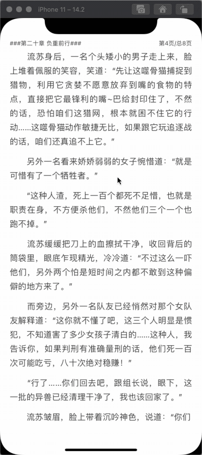
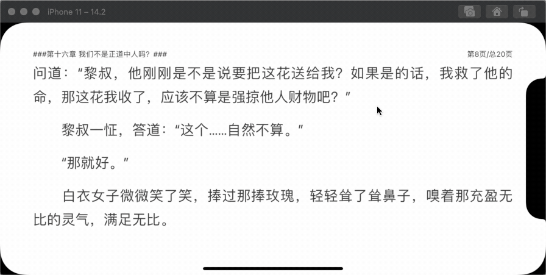
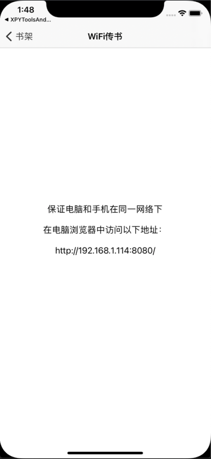

# XPYReader —— 一个用心写的小说阅读器

*******************

## 运行环境
iOS 9.0+

## 为了以后更好地进行模块化、组件化开发，提前整理了项目文件结构

### Application : 存放AppDelegate、main、pch等应用必须文件

### Module : 业务模块，该模块中每个文件夹都可以作为一个业务组件，业务组件中具体设计模式可以自行选用

### Model : 数据模型模块 ，该模块原本属于业务模块中任一组件，因为该项目没有细分ViewModel，将部分网络请求类的分类关联了Model放在此处，为了不重复在业务组件中新建数据模型，所以暂时将Model独立出来

### Database : 本地数据持久化相关内容

### Global : 业务模块相关工具类模块，该模块中封装了一些工具了类，这些工具类与业务模块功能相关，后期会将该模块拆分进业务模块中

### Utils : 通用工具模块，封装了一些可以单独使用的工具类

### Macros : 存放宏、类型常量、枚举、内联函数等相关文件

### Vendor : 手动引用的第三方库文件

### Resource : 项目资源文件

## 功能描述

### 多种翻页模式灵活切换

### 滚动和覆盖双模式自动阅读

### 书籍章节目录和进度选择

### 阅读背景模式选择

### 阅读设置

### 横屏阅读

### 本地书上传（WiFi传书）

## 关键方法举例

### 解析章节内容返回章节分页信息

    parseChapterWithChapterContent:chapterName:

### 本地书解析分章

    parseLocalBookWithFilePath:success:failure:
    

## 主要第三方库

[WCDB](https://github.com/Tencent/wcdb)

[Masonry](https://github.com/SnapKit/Masonry)

[YYModel](https://github.com/ibireme/YYModel)

[GCDWebServer](https://github.com/swisspol/GCDWebServer)

*******************

## 喜欢的客官不要吝惜你的点赞噢❤️

